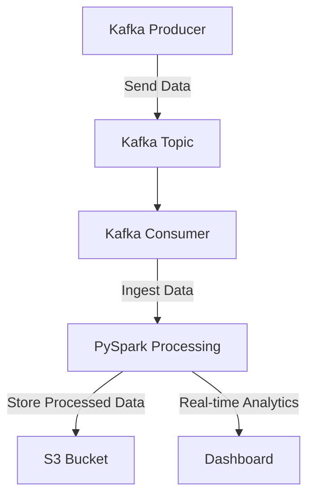

# Building a Real-Time Data Pipeline with Kafka and PySpark

## Introduction

Welcome to my journey of building a real-time data pipeline using Apache Kafka and PySpark!

This project is a hands-on experience designed to showcase how we can leverage these powerful technologies to process streaming data efficiently.

## Project Overview

In this project, we'll set up a real-time data pipeline on AWS, utilizing Apache Kafka for streaming data ingestion and PySpark for processing. Our goal is to create a robust, scalable solution capable of handling large volumes of data with low latency.

## Directory Structure
```
real-time-data-pipeline/
├── kafka/
│   ├── producer.py
│   └── consumer.py
├── pyspark/
│   ├── spark_processing.py
│   └── requirements.txt
├── aws/
│   ├── setup_msk_cluster.sh
│   ├── deploy_lambda.sh
│   └── create_s3_bucket.sh
├── terraform/
│   ├── main.tf
│   ├── variables.tf
│   └── outputs.tf
├── README.md
└── LICENSE
```

## Workflow

The following flowchart illustrates the workflow of our real-time data pipeline:



### Workflow Steps:

1. **Kafka Producer**: Produces data and sends it to the Kafka topic.
2. **Kafka Topic**: Acts as a buffer and stores the data temporarily.
3. **Kafka Consumer**: Consumes data from the Kafka topic and ingests it into PySpark.
4. **PySpark Processing**: Processes the ingested data, performs transformations, and analytics.
5. **Data Storage**: Stores the processed data in an S3 bucket for further use.
6. **Real-time Analytics**: Data can be visualized on a real-time dashboard.

## Why This Project?

I embarked on this project to deepen my understanding of real-time data processing and explore the practical applications of Kafka and PySpark. This project is an excellent opportunity to learn how to set up, configure, and integrate these tools to build a functional data pipeline.

## Prerequisites

Before we start, make sure you have the following:

- AWS account
- Basic knowledge of Kafka and PySpark
- Python installed on your local machine
- AWS CLI configured

## Theoretical Foundations

### Apache Kafka

Kafka is a distributed streaming platform used for building real-time data pipelines and streaming applications. It is designed to handle high throughput and low latency, making it ideal for real-time analytics and monitoring.

#### Key Concepts:

- **Producers**: Publish data to Kafka topics.
- **Consumers**: Subscribe to topics and process the published data.
- **Topics**: Categories or feed names to which records are published.
- **Partitions**: Sub-divisions of topics to allow parallel processing.
- **Brokers**: Kafka servers that manage the persistence and replication of data.

### PySpark

PySpark is the Python API for Apache Spark, an open-source, distributed computing system. PySpark allows us to use Spark's powerful data processing capabilities with Python.

#### Key Concepts:

- **RDD (Resilient Distributed Dataset)**: Fundamental data structure of Spark, immutable and distributed across nodes.
- **DataFrame**: A distributed collection of data organized into named columns, similar to a table in a database.
- **Transformations and Actions**: Operations on RDDs/DataFrames that define the computation and trigger execution, respectively.

### AWS Managed Streaming for Apache Kafka (MSK)

AWS MSK is a fully managed service that makes it easy to build and run applications that use Apache Kafka. MSK manages the provisioning, configuration, and maintenance of Apache Kafka clusters.

## Steps to Set Up the Real-Time Data Pipeline

### Step 1: Set Up Kafka on AWS MSK

1. **Open the Amazon MSK Console**: Navigate to the Amazon MSK console in your AWS account.
2. **Create a New Cluster**: Click on "Create Cluster" and choose the settings that best suit your needs. For this example, we'll use a simple configuration.
3. **Configure the Cluster**: Choose the VPC, subnets, and security groups. Make sure your security group allows inbound traffic on the Kafka port (usually 9092).
4. **Enable IAM Authentication**: Under security settings, enable IAM role-based authentication. Configure the IAM policy to specify which actions you want to allow or deny.
5. **Create Topics**: After your cluster is up and running, create the topics needed for your data streams.

### Step 2: Install Kafka on EC2

1. **Launch EC2 Instance**: Launch an Amazon Linux 2 instance and connect to it via SSH.
2. **Install Java**:
   ```bash
   sudo amazon-linux-extras install java-openjdk11 -y
   ```
3. **Download and Extract Kafka**:
   ```bash
   wget https://archive.apache.org/dist/kafka/2.6.0/kafka_2.12-2.6.0.tgz
   tar -xzf kafka_2.12-2.6.0.tgz
   cd kafka_2.12-2.6.0
   ```
4. **Configure Kafka**:
   Edit the `server.properties` file to set the appropriate configurations for your environment.
5. **Start Kafka Server**:
   ```bash
   bin/kafka-server-start.sh config/server.properties
   ```

### Step 3: Set Up PySpark

1. **Install PySpark**:
   ```bash
   pip install pyspark
   ```
2. **Create PySpark Script**:
   ```python
   from pyspark.sql import SparkSession
   from pyspark.sql.functions import col

   spark = SparkSession.builder \
       .appName("Kafka-PySpark-Integration") \
       .getOrCreate()

   # Read data from Kafka
   df = spark \
       .readStream \
       .format("kafka") \
       .option("kafka.bootstrap.servers", "your-kafka-broker:9092") \
       .option("subscribe", "your-topic") \
       .load()

   # Process data
   processed_df = df.selectExpr("CAST(value AS STRING) as message")

   # Write data to console
   query = processed_df.writeStream \
       .outputMode("append") \
       .format("console") \
       .start()

   query.awaitTermination()
   ```
3. **Run the PySpark Script**:
   ```bash
   spark-submit your_script.py
   ```

### Step 4: Automate with AWS Lambda and CloudWatch

1. **Create an AWS Lambda Function**: This function will start and stop your EC2 instance to save costs.
2. **Set Up CloudWatch Events**: Schedule CloudWatch events to trigger the Lambda function at specified times to manage your EC2 instance.

### Step 5: Monitoring and Logging

1. **Set Up Monitoring**: Use AWS CloudWatch to monitor your Kafka and EC2 instances.
2. **Integrate Logging**: Implement logging for your PySpark jobs to track performance and errors.

## Conclusion

This project showcases how to build a real-time data pipeline using Kafka and PySpark on AWS. It covers the setup, configuration, and integration of these tools to create a functional and scalable solution. I'm excited to continue refining this project and exploring new possibilities in real-time data processing!

Feel free to explore the repository, try out the code, and share your feedback. Let's build something amazing together!

---

### Skills Utilized

- **Data Streaming**: Kafka
- **Data Processing**: PySpark
- **Cloud Services**: AWS (MSK, EC2, Lambda, CloudWatch)
- **DevOps Tools**: Git, CI/CD

---

Let's connect and discuss more about real-time data processing and cloud solutions. Happy coding!
